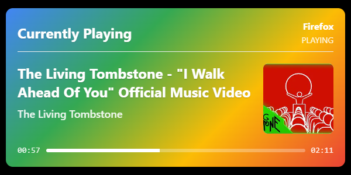
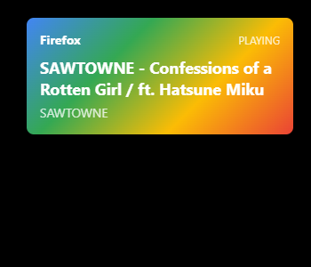
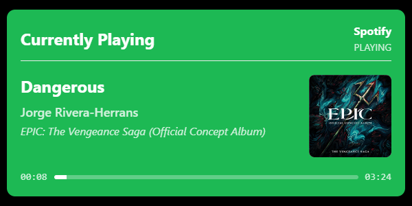
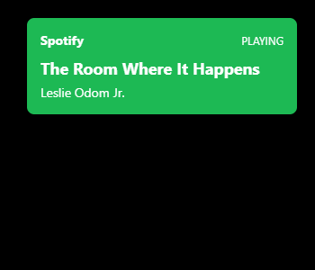
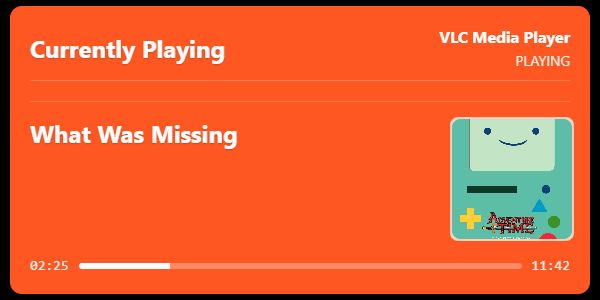

# Windows Media Stream Widget

A web-based widget that displays information about currently playing media on Windows. The application integrates with Windows APIs to access media information and presents it through a local web server.

## Features

- Displays information about currently playing media (song name, artist, album, app name, playback status)
- Shows playback position and duration
- Provides two viewing options:
  - `/currentlyplaying`: A persistent display showing all media information
  - `/nowplaying`: A notification-style display that appears briefly when media changes
- Customizable styling based on the media application (different styles for Spotify, VLC, Firefox, etc.)

## Screenshots

| Application | Currently Playing View | Now Playing View *(Notification style)* |
|-------------|------------------------|-----------------|
| **Browsers** |  |  |
| **Spotify** |  |  |
| **VLC Media Player** |  |  |

⚠ VLC Media Player doesn't have Windows 10 SMTC integration. Use something like https://github.com/spmn/vlc-win10smtc with VLC to enable it.
> *Note: vlc-win10smtc seemingly takes up to 20s to load media information.*

## Requirements

- Windows 10 or later
- Python 3.9 or higher
- Required Python packages:
  - flask
  - winrt-Windows.Media.Control
  - winrt-Windows.Foundation
  - winrt-runtime

## Usage
1. Download/Clone this repo:
2. Run the `run_app.py` at least once (it installs dependencies):
```
python run_app.py
```
3. Add these sourses to OBS
- `http://localhost:5000/currentlyplaying` - For the full media display (Best at 600x300)
- `http://localhost:5000/nowplaying` - For the notification-style display (Best at 350x300)
4. Go to OBS > Tools > Scripts > Python Settings > Browse > Select your Python path.
5. Go to OBS > Tools > Scripts > **+** (Add) > `obs_autostart_webserver.py`.

## Customization

You can customize the appearance of the widget by modifying the `workspace/static/style.scss` file. The widget uses the `data-app-name` attribute to apply application-specific styling, making it easy to create unique styles for different media applications.

> In case if script or your custom designs doesn't work with `workspace/static/style.scss` you can enable `backup.style.css` by deleting `backup` from file name. 

## Project Structure

- `workspace/code/media_manager.py`: Core module that interacts with Windows Media APIs
- `workspace/code/app.py`: Flask web server that serves the media information
- `workspace/templates/currently_playing.html`: Template for the full display
- `workspace/templates/now_playing_notification.html`: Template for the notification display
- `workspace/static/style.scss`: SCSS styling for both displays
- `workspace/static/backup.style.css`: Backup CSS styling for both displays

## How It Works

1. The application uses the Windows Runtime API through `pywinrt` to access the `GlobalSystemMediaTransportControlsSessionManager`
2. It monitors for media changes using event handlers
3. When media changes are detected, the information is captured and made available through the web server
4. The web interface periodically polls the server for updates and refreshes the display accordingly

## TODO

- [ ] Add more custom CSS for apps.
- [ ] Figure out how to access tab/domain information in browser.
- [ ] Make it so OBS can start script when needed.
- [ ] Make actual player from this thing?
